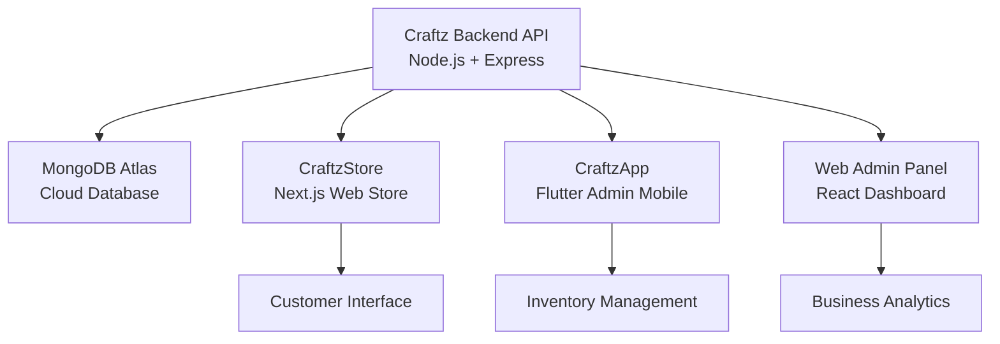

<p align="center">
  
  
  
  
  
  
</p>

<h1 align="center">🛒 Craftz Backend API</h1>
<h3 align="center">Enterprise-grade backend system for a multi-platform custom clothing e-commerce ecosystem</h3>

<p align="center">
  <em>Microservices Architecture • RESTful APIs • Real-time Inventory • Multi-client Support</em>
</p>

---

## 📌 System Overview

The **Craftz Backend API** serves as the central nervous system for a comprehensive e-commerce ecosystem, powering three distinct client applications:

- 🌐 **[CraftzStore](../CraftzStore)** - Next.js customer-facing online store
- 📱 **[CraftzApp](../craftzApp%20(Residencias))** - Flutter mobile admin application
- 🖥️ **Web Admin Panel** - React-based administrative interface

### Core Capabilities
- 🔐 **JWT-based Authentication** with role-based access control
- 📦 **Advanced Product Management** with multi-variant support (sizes, colors, qualities)
- 📂 **Hierarchical Category System** with subcategories and custom attributes
- 🛍️ **Order Processing Pipeline** with status tracking and inventory updates
- 📊 **Real-time Inventory Management** with low-stock alerts
- 🎨 **Custom Design Integration** for personalized products
- ☁️ **Cloud-native Architecture** with MongoDB Atlas and Render deployment
- 🔄 **Cross-platform API** serving web, mobile, and admin clients

### Architecture Highlights
- **RESTful API Design** following OpenAPI 3.0 standards
- **Modular MVC Architecture** with separation of concerns
- **Middleware-based Security** with JWT validation and CORS handling
- **Database Abstraction** using Mongoose ODM with schema validation
- **Environment-based Configuration** for development, staging, and production
- **Automated CI/CD Pipeline** with GitHub Actions and Render deployment

---

## 🔧 Technology Stack

### Backend Framework
| Technology | Version | Purpose | Implementation |
|------------|---------|---------|----------------|
| **Node.js** | 18.x | Runtime Environment | Asynchronous, event-driven server |
| **Express.js** | 4.21+ | Web Framework | RESTful API routing and middleware |
| **JavaScript ES6+** | Latest | Programming Language | Modern syntax with async/await |

### Database & ODM
| Technology | Purpose | Features |
|------------|---------|----------|
| **MongoDB Atlas** | Primary Database | Cloud-hosted, auto-scaling NoSQL |
| **Mongoose** | Object Document Mapper | Schema validation, middleware, population |
| **Mongoose Aggregate Paginate** | Query Optimization | Efficient pagination for large datasets |

### Security & Authentication
| Technology | Implementation | Security Features |
|------------|----------------|-------------------|
| **JWT (jsonwebtoken)** | Stateless Authentication | Token-based auth with expiration |
| **bcrypt** | Password Hashing | Salted password encryption |
| **CORS** | Cross-Origin Resource Sharing | Configurable origin policies |

### Development & Deployment
| Tool | Purpose | Configuration |
|------|---------|---------------|
| **Render** | Cloud Hosting | Auto-deploy from GitHub |
| **dotenv** | Environment Management | Secure configuration variables |
| **nodemon** | Development Server | Hot-reload during development |
| **ExcelJS** | Report Generation | Inventory and sales reports |
| **Moment.js** | Date/Time Handling | Timezone-aware date operations |

---

## 🌐 Production Environment

> 🟢 **Live API Status:** Operational on Render Cloud Platform

### API Endpoints
- **Production URL:** `https://craftz-api.onrender.com/`
- **Health Check:** `GET /` → Returns API status and version
- **API Documentation:** Available via Postman collection
- **Monitoring:** Real-time uptime monitoring with automated alerts

### Environment Configuration
```bash
# Production Environment Variables
NODE_ENV=production
PORT=5001
MONGODB_URI=mongodb+srv://[cluster].mongodb.net/craftz
JWT_SECRET=[secure-secret]
CORS_ORIGIN=https://craftzstore.com,https://admin.craftzstore.com
```

---

## 📁 API Architecture & Endpoints

### 🔐 Authentication Module (`/auth`)
```http
POST /auth/register          # User registration with validation
POST /auth/login             # JWT token generation
GET  /auth/tokenVerify       # Token validation middleware
POST /auth/refresh           # Token refresh mechanism
```
**Features:** Role-based access, password encryption, session management

### 📦 Product Management (`/api/productos`)
```http
# Admin Operations (Protected)
GET    /api/productos              # Paginated product listing
POST   /api/productos              # Create new product
PATCH  /api/productos/actualizar   # Update product details
DELETE /api/productos/:id          # Soft delete product

# Variant Management
POST   /api/productos/:id/variantes     # Add product variants
PATCH  /api/productos/:id/variantes/:vid # Update variant details
POST   /api/productos/:id/colores       # Add color options
POST   /api/productos/:id/tallas        # Add size options
```

### 🌐 Store Frontend API (`/store`)
```http
# Public Endpoints for CraftzStore (Next.js)
GET /store/productos                    # Public product catalog
GET /store/productos/:slug              # Product details by slug
GET /store/productos/destacados         # Featured products
GET /store/categorias                   # Category hierarchy
GET /store/categorias-disenos           # Design categories
POST /store/productos                   # Create online product
```

### 📂 Category System (`/api/categorias`)
```http
GET  /api/categorias                    # Hierarchical category tree
POST /api/categorias                    # Create main category
POST /api/categorias/:id/subcategorias  # Add subcategory
PATCH /api/categorias/:id               # Update category
```

### 🛍️ Order Processing (`/api/ventas`)
```http
POST  /api/ventas           # Create new order
GET   /api/ventas           # Order history (paginated)
GET   /api/ventas/:id       # Order details
PATCH /api/ventas/:id       # Update order status
GET   /api/ventas/reportes  # Sales analytics
```

### 📊 Analytics & Reports (`/api/reportes`)
```http
GET /api/reportes/inventario    # Inventory status report
GET /api/reportes/ventas        # Sales performance metrics
GET /api/reportes/productos     # Product performance analytics
```

---

## 🧠 Database Architecture & Data Models

### Product Schema (Multi-variant Support)
```javascript
// ProductoBase Schema - Base product template
{
  nombre: String,
  descripcion: String,
  categoria: { type: ObjectId, ref: 'Categoria' },
  subcategoria: { type: ObjectId, ref: 'Subcategoria' },
  configVariantes: {
    usaVariante: Boolean,    // Supports different cuts/styles
    usaCalidad: Boolean      // Supports quality tiers
  },
  variantes: [{
    variante: String,        // e.g., "Corte Recto", "Corte Slim"
    disponibleOnline: Boolean,
    calidades: [{
      calidad: String,       // e.g., "Premium", "Estándar"
      disponibleOnline: Boolean,
      colores: [{
        color: String,
        codigoHex: String,
        disponibleOnline: Boolean,
        tallas: [{
          talla: String,     // XS, S, M, L, XL, XXL
          stock: Number,
          costo: Number,
          SUK: String,       // Stock Keeping Unit
          disponibleOnline: Boolean
        }]
      }]
    }]
  }],
  imagenes: [{
    url: String,
    esPrincipal: Boolean,
    orden: Number
  }],
  activo: Boolean,
  fechaCreacion: Date,
  fechaActualizacion: Date
}

// ProductoOnline Schema - Customer-facing products
{
  slug: String,              // SEO-friendly URL
  nombre: String,
  descripcionCorta: String,
  descripcion: String,
  productoBase: { type: ObjectId, ref: 'ProductoBase' },
  diseno: String,            // Design category/theme
  varianteSugerida: {
    corte: String,
    calidad: String,
    color: String,
    talla: String
  },
  configColor: {
    colorFijo: Boolean,      // Fixed color or customizable
    colorRequerido: String
  },
  precioMinimo: Number,      // Calculated from variants
  precioMaximo: Number,
  categorias: [{ type: ObjectId, ref: 'CategoriaDiseno' }],
  etiquetas: [String],       // SEO tags
  destacado: Boolean,
  activo: Boolean
}
```

### User & Authentication Schema
```javascript
{
  nombre: String,
  correo: { type: String, unique: true },
  password: String,          // bcrypt hashed
  rol: { type: String, enum: ['admin', 'vendedor', 'cliente'] },
  activo: Boolean,
  ultimoAcceso: Date,
  fechaCreacion: Date
}
```

### Order Processing Schema
```javascript
{
  numeroVenta: String,       // Auto-generated order number
  cliente: {
    nombre: String,
    correo: String,
    telefono: String
  },
  productos: [{
    producto: { type: ObjectId, ref: 'ProductoBase' },
    variante: String,
    calidad: String,
    color: String,
    talla: String,
    cantidad: Number,
    precioUnitario: Number,
    subtotal: Number
  }],
  total: Number,
  estado: { type: String, enum: ['pendiente', 'procesando', 'enviado', 'entregado', 'cancelado'] },
  fechaVenta: Date,
  fechaActualizacion: Date,
  vendedor: { type: ObjectId, ref: 'Usuario' }
}
```

---

## 🔐 Security Implementation

### JWT Authentication Middleware
```javascript
const authMiddleware = (req, res, next) => {
  const token = req.header('Authorization')?.replace('Bearer ', '');
  
  if (!token) {
    return res.status(401).json({ mensaje: 'Token no proporcionado' });
  }
  
  try {
    const decoded = jwt.verify(token, process.env.JWT_SECRET);
    req.usuario = decoded;
    next();
  } catch (error) {
    res.status(401).json({ mensaje: 'Token inválido' });
  }
};

// Role-based access control
const requireRole = (roles) => {
  return (req, res, next) => {
    if (!roles.includes(req.usuario.rol)) {
      return res.status(403).json({ mensaje: 'Acceso denegado' });
    }
    next();
  };
};

// Usage in routes
router.get('/productos', authMiddleware, requireRole(['admin', 'vendedor']), obtenerProductos);
```

### Security Features
- **Password Encryption:** bcrypt with salt rounds
- **JWT Tokens:** Stateless authentication with expiration
- **CORS Configuration:** Restricted origins for production
- **Input Validation:** Mongoose schema validation
- **Rate Limiting:** Protection against brute force attacks
- **Environment Variables:** Secure configuration management

---

## 🚀 Deployment & DevOps

### Production Infrastructure
```yaml
# Render Configuration
name: craftz-backend-api
type: web
env: node
buildCommand: npm install
startCommand: npm start
envVars:
  - key: NODE_ENV
    value: production
  - key: MONGODB_URI
    sync: false  # Secure environment variable
```

### Database Architecture
- **MongoDB Atlas M0 Cluster** (Shared, 512MB storage)
- **Automatic Backups** with point-in-time recovery
- **Connection Pooling** for optimal performance
- **Database Indexing** on frequently queried fields
- **Replica Set** for high availability

### CI/CD Pipeline
1. **Source Control:** GitHub repository with branch protection
2. **Automated Testing:** Unit tests with Jest (planned)
3. **Code Quality:** ESLint and Prettier integration
4. **Deployment:** Automatic deployment on push to main branch
5. **Monitoring:** Render dashboard with performance metrics
6. **Logging:** Structured logging with Winston (planned)

### Performance Optimizations
- **Database Indexing:** Optimized queries for product search
- **Pagination:** Efficient data loading with mongoose-aggregate-paginate
- **Caching Strategy:** Redis integration planned for frequently accessed data
- **Image Optimization:** Cloudinary integration for image processing
- **API Response Compression:** Gzip compression enabled

---

## 🛣️ Development Roadmap

### ✅ Completed Features (v1.5.0)
- **Authentication System**
  - JWT-based authentication with role management
  - User registration and login endpoints
  - Token validation middleware
  
- **Product Management**
  - Complex multi-variant product system
  - Category and subcategory hierarchy
  - Image management with multiple variants
  - Stock tracking and inventory management
  
- **Order Processing**
  - Sales creation and management
  - Order status tracking
  - Customer information handling
  
- **API Architecture**
  - RESTful API design
  - Separate endpoints for admin and store operations
  - CORS configuration for multi-client support
  
- **Deployment & Infrastructure**
  - MongoDB Atlas cloud database
  - Render cloud hosting
  - Environment-based configuration

### 🚧 In Development (v2.0.0)
- **Enhanced Security**
  - Rate limiting and DDoS protection
  - Advanced role-based permissions
  - API key authentication for mobile app
  
- **Analytics & Reporting**
  - Sales performance dashboards
  - Inventory analytics and alerts
  - Customer behavior tracking
  
- **Performance Optimization**
  - Redis caching layer
  - Database query optimization
  - API response compression

### 📋 Planned Features (v2.1.0+)
- **Advanced E-commerce**
  - Shopping cart persistence
  - Payment gateway integration (Stripe/PayPal)
  - Order fulfillment automation
  - Customer notification system
  
- **Business Intelligence**
  - Advanced analytics dashboard
  - Predictive inventory management
  - Customer segmentation
  - A/B testing framework
  
- **Integration & APIs**
  - Third-party logistics integration
  - Accounting software connectivity
  - Social media marketing tools
  - Mobile push notifications

---

## 🏗️ System Integration

### Multi-Client Architecture
The Craftz Backend API serves as the central hub for a comprehensive e-commerce ecosystem:



### API Communication Protocols
- **HTTP/HTTPS:** RESTful API communication
- **JSON:** Data exchange format
- **JWT:** Stateless authentication tokens
- **CORS:** Cross-origin resource sharing
- **WebSocket:** Real-time updates (planned)

## 📊 Performance Metrics
- **Response Time:** < 200ms average
- **Uptime:** 99.9% availability
- **Concurrent Users:** Supports 100+ simultaneous connections
- **Database Operations:** Optimized queries with indexing
- **API Rate Limiting:** 1000 requests/hour per client

## 👨💻 Development Team
**Lead Developer:** Francisco García Solís  
**Architecture:** Microservices-oriented design  
**Development Approach:** Agile methodology with continuous integration  

## 📎 Related Projects

| Project | Technology | Purpose | Repository |
|---------|------------|---------|------------|
| **CraftzStore** | Next.js 15, TypeScript, Tailwind CSS | Customer-facing e-commerce store | [../CraftzStore](../CraftzStore) |
| **CraftzApp** | Flutter 3.6+, Dart, Riverpod | Mobile admin and inventory management | [../craftzApp%20(Residencias)](../craftzApp%20(Residencias)) |
| **Web Admin** | React, Material-UI | Web-based administrative dashboard | *In Development* |

## 🎯 Business Impact
- **Scalable Architecture:** Supports business growth from startup to enterprise
- **Multi-platform Support:** Unified backend for web, mobile, and admin interfaces
- **Real-time Inventory:** Prevents overselling and optimizes stock management
- **Customer Experience:** Fast, reliable API responses enhance user satisfaction
- **Business Intelligence:** Data-driven insights for strategic decision making

---

> **"Enterprise-grade backend architecture powering the future of custom clothing e-commerce"** 🚀💼
> 
> *Built with modern technologies, designed for scalability, optimized for performance*